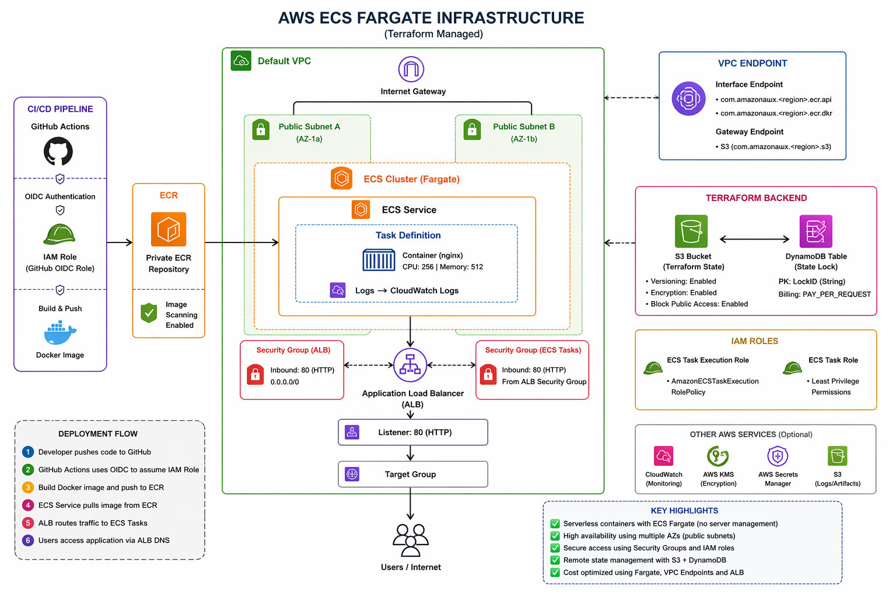

# Terraform AWS ECS Infrastructure

Deploys a production-ready ECS Fargate application on AWS with:
- Remote state (S3 + DynamoDB)
- ECR private repository
- ECS Fargate cluster + service
- Application Load Balancer
- IAM roles (least privilege)
- GitHub Actions OIDC (passwordless ECR push)
- CloudWatch logging

---

## Project Structure

```
project/
├── bootstrap/
│   ├── bootstrap.tf      # S3 bucket + DynamoDB table for remote state
│   ├── variables.tf
│   └── terraform.tfvars
│
└── main/
    ├── backend.tf        # S3 remote backend (update after bootstrap)
    ├── variables.tf      # All variable declarations
    ├── terraform.tfvars  # All variable values
    ├── main.tf           # Provider + VPC data sources
    ├── ecr.tf            # ECR private repository
    ├── iam.tf            # ECS roles + GitHub Actions OIDC
    ├── alb.tf            # ALB + security group + target group + listener
    ├── ecs.tf            # ECS cluster + task definition + CloudWatch
    ├── service.tf        # ECS Fargate service + security group
    └── outputs.tf        # All outputs
```

---

## Deploy

### Step 1 — Bootstrap remote state (run once)

```bash
cd bootstrap
terraform init
terraform apply -auto-approve

# Note the outputs:
terraform output s3_bucket_name
terraform output dynamodb_table_name
```

### Step 2 — Update backend.tf

Edit `main/backend.tf` and replace placeholders:

```hcl
bucket         = "<value from s3_bucket_name output>"
dynamodb_table = "<value from dynamodb_table_name output>"
```

### Step 3 — Update terraform.tfvars

Edit `main/terraform.tfvars`:

```hcl
github_org  = "your-actual-github-org"
github_repo = "your-actual-github-repo"
```

### Step 4 — Deploy main infrastructure

```bash
cd ../main
terraform init
terraform apply -auto-approve
```

---

## Key Outputs

| Output | Description |
|---|---|
| `alb_dns_name` | App URL — open in browser |
| `ecr_repository_url` | Push Docker images here |
| `github_actions_role_arn` | Use in GitHub Actions workflow |

---

## GitHub Actions Usage

```yaml
permissions:
  id-token: write
  contents: read

steps:
  - name: Configure AWS credentials
    uses: aws-actions/configure-aws-credentials@v4
    with:
      role-to-assume: ${{ secrets.AWS_ROLE_ARN }}  # github_actions_role_arn output
      aws-region: us-east-1

  - name: Login to ECR
    uses: aws-actions/amazon-ecr-login@v2

  - name: Build and push
    run: |
      docker build -t $ECR_REGISTRY/$ECR_REPOSITORY:$IMAGE_TAG .
      docker push $ECR_REGISTRY/$ECR_REPOSITORY:$IMAGE_TAG
```

---

## Tear Down

```bash
# Main infra first
cd main
terraform destroy -auto-approve

# Then bootstrap
cd ../bootstrap
terraform destroy -auto-approve
```
